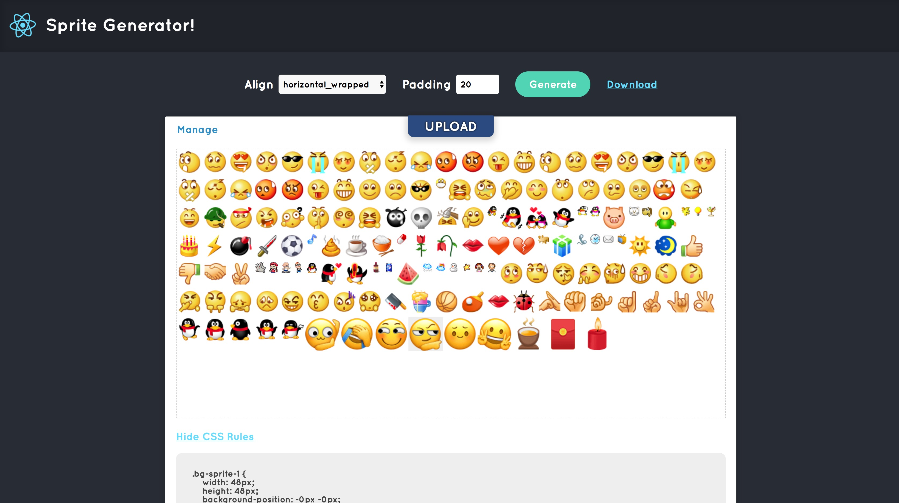

## Why built it

1: To scratch my own itch, and also get a taste of Typescript, which I've found out quite interesting.

2: To generate sprite without uploading all images, without waiting, and with ordering.

## How it Looks

## Where to use

[Portal Gate](https://silentmaker.github.io/sprite-generator)
